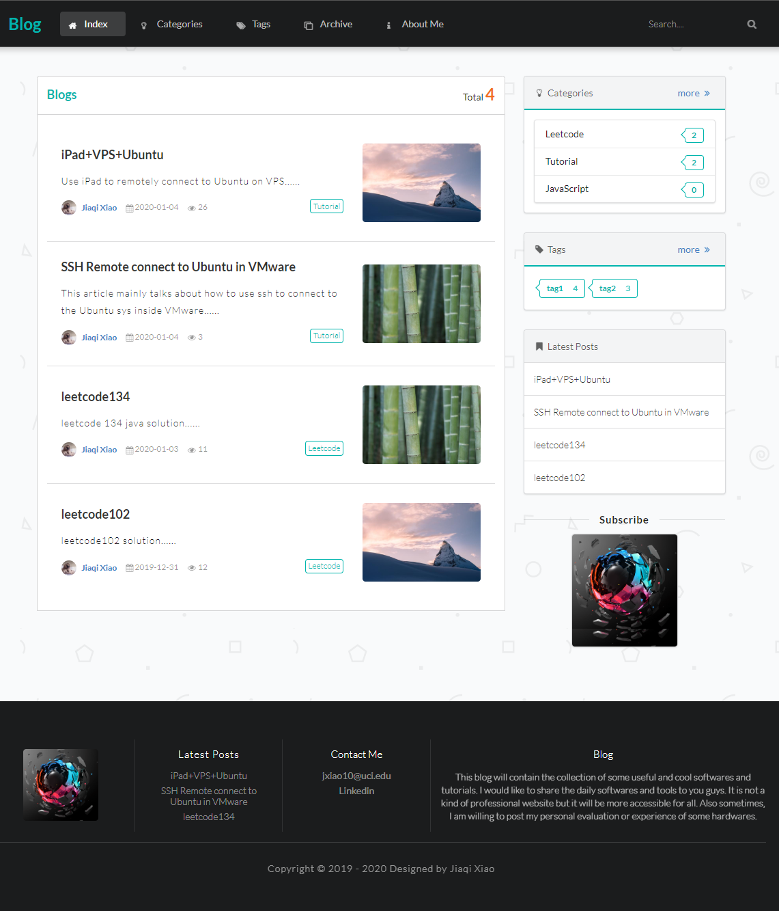

# Spring Boot Personal Blog

---

This is a full-stack blog website project. It utilized Semantic and Thymeleaf to build responsive front-end website. It's back-end development based on Spring boot frameworks.

## Preview

 

## Feature

### Visitor

- Browse all the articles
- Browse articles from different categories and tags
- Read articles on smartphones by QR code
- Global Search inside the website
- Donate the website

### Administrator

- Login into the management system
- Upload/Delete/Update articles
- Attach tags and categories to articles
- New/Delete/Edit tags and categories

## Frameworks/Libraries

### Back-End

- Spring Boot
- JPA
- Thymeleaf
- MySQL

### Front-End

- Semantic UI

### Webpage Plugins

[Editor](https://pandao.github.io/editor.md/) -- markdown editor

[typo.css](https://github.com/sofish/typo.css) -- content format

[animate.css](https://daneden.github.io/animate.css/) -- animate

[prism](https://github.com/PrismJS/prism) -- syntax highlighting

[Tocbot](https://tscanlin.github.io/tocbot/) -- catalog generation

[waypoints](http://imakewebthings.com/waypoints/) -- scroll detector

[jquery.scrollTo](https://github.com/flesler/jquery.scrollTo) -- animated scrolling with jQuery

[qrcode.js](https://davidshimjs.github.io/qrcodejs/) --QR code generation

## License

MIT